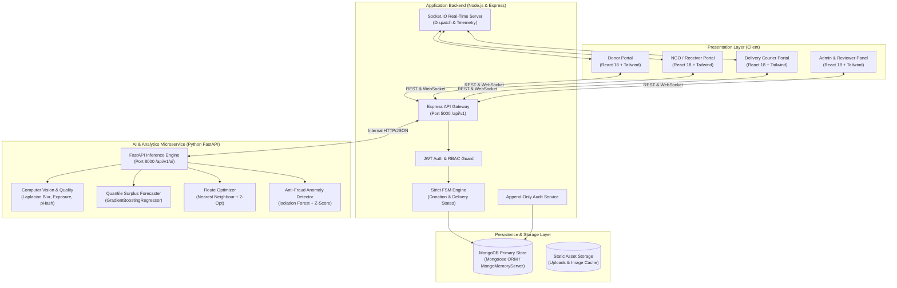
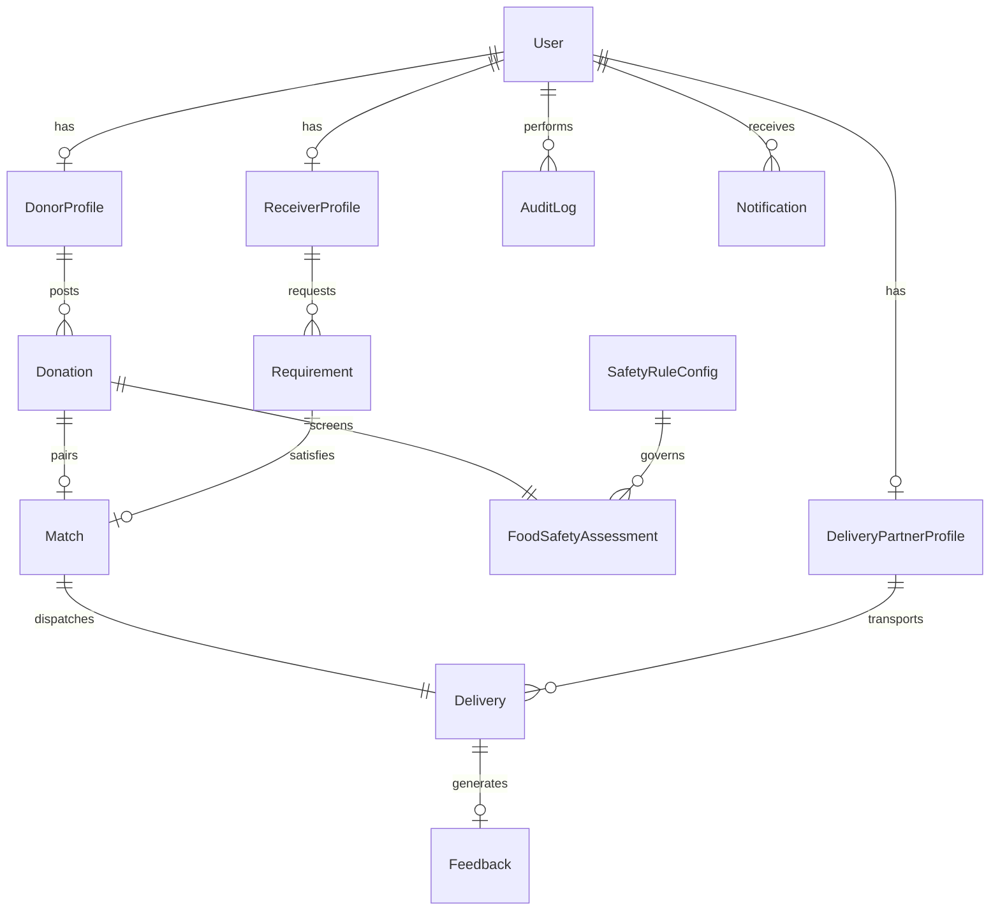

# AnnSarthi Architecture & System Design Document
**Smart Food Waste Redistribution Ecosystem (SIH26234)**

---

## 1. Executive Summary

**AnnSarthi** is an end-to-end, multi-sided digital ecosystem connecting surplus food donors (hotels, caterers, corporations, restaurants, households) with verified non-governmental organizations (NGOs), community kitchens, shelters, and an on-demand logistics network of delivery partners.

The platform solves critical operational bottlenecks in food redistribution:
1. **Perishability & Safety**: Rigorous AI-assisted food safety risk screening, shelf-life verification, image quality checks, and temperature logging backed by an administrative human review queue.
2. **Logistical Asymmetry**: Explainable multi-factor bipartite matching between donor supply and receiver capacity, factoring in travel distance, diet constraints, and cold-chain capabilities.
3. **Route Inefficiencies**: Heuristic Traveling Salesperson Problem (TSP) multi-stop pickup routing with 2-Opt local search optimization.
4. **Accountability & Trust**: Dual-factor OTP verification at pickup and dropoff, digital recipient signatures, tamper-evident append-only audit logging, and verifiable LCA-based environmental impact accounting.

---

## 2. High-Level System Architecture

AnnSarthi employs a modular, distributed microservice architecture:



---

## 3. Core Database Entities (ERD Schema)



### 3.1 Primary Schema Definitions

| Entity | Primary Keys / Foreign Keys | Critical Attributes |
| :--- | :--- | :--- |
| **User** | `_id` | `email`, `passwordHash`, `role` (`DONOR`, `RECEIVER`, `DELIVERY_PARTNER`, `ADMIN`), `phone`, `isVerified`, `status` |
| **DonorProfile** | `_id`, `userId` | `organizationName`, `donorType`, `fssaiLicenseNumber`, `address`, `location` (GeoJSON Point), `trustScore` (0-100) |
| **ReceiverProfile** | `_id`, `userId` | `organizationName`, `receiverType`, `registrationNumber`, `beneficiaryCount`, `storageFacilities`, `location` |
| **DeliveryPartnerProfile**| `_id`, `userId` | `vehicleType`, `capacityKg`, `insulatedStorage`, `licenseNumber`, `rating`, `currentLocation`, `isAvailable` |
| **Donation** | `_id`, `donorId` | `foodName`, `category`, `dietType`, `quantity`, `estimatedMeals`, `preparationDateTime`, `storageMethod`, `pickupDeadline`, `status` |
| **FoodSafetyAssessment** | `_id`, `donationId` | `riskLevel` (`LOW`, `MEDIUM`, `HIGH`), `score`, `reasons`, `requiredAction`, `method` (`rule-based` vs `ml`), `confidence`, `ruleResults`, `imageAnalysis` |
| **Requirement** | `_id`, `receiverId` | `foodCategory`, `dietPreference`, `requiredMeals`, `urgency` (`STANDARD`, `URGENT`, `CRITICAL`), `neededBy` |
| **Match** | `_id`, `donationId`, `receiverId` | `compatibilityScore` (0-100), `distanceKm`, `scoreBreakdown`, `status` |
| **Delivery** | `_id`, `matchId`, `partnerId` | `status`, `pickupOtpHash`, `deliveryOtpHash`, `pickupVerifiedAt`, `deliveredAt`, `recipientSignatureUrl`, `temperatureLogs` |
| **AuditLog** | `_id`, `performedBy` | `entityType`, `entityId`, `action`, `previousState`, `newState`, `ipAddress`, `immutableTimestamp` |
| **SafetyRuleConfig** | `_id` | `shelfLifeMatrixHours`, `minPickupWindowHours`, `autoVerifyLowRisk`, `mandatoryImageRequired`, `allowedPackagingTypes` |

---

## 4. State Machines & Conflict Management

AnnSarthi enforces strict state transitions. Any attempt to skip states, leap forward without verified checkpoints, or transition from terminal states throws a `ConflictError` resulting in an HTTP `409 Conflict`.

### 4.1 Donation Finite State Machine
```
[DRAFT] ──> [SUBMITTED] ──> [SCREENING]
                                │
        ┌───────────────────────┴──────────────────────┐
        ▼                                              ▼
   [VERIFIED] (Low Risk)                   [REVIEW_REQUIRED] (High/Med Risk)
        │                                              │
        │                                              ├─ Approved ──> [VERIFIED]
        │                                              └─ Rejected ──> [REJECTED]*
        ▼
    [MATCHED]
        │
        ▼
 [PICKUP_ASSIGNED]
        │
        ▼
   [PICKED_UP] ──(OTP Validated)
        │
        ▼
   [IN_TRANSIT]
        │
        ▼
   [DELIVERED] ──(Dropoff OTP + Signature)
        │
        ▼
  [COMPLETED]*
```
*\* Terminal States: Once a donation is `COMPLETED`, `REJECTED`, or `CANCELLED`, no further transitions are legally permissible.*

### 4.2 Delivery Finite State Machine
```
[AVAILABLE] ──> [ASSIGNED] ──> [ACCEPTED] ──> [PICKUP_STARTED]
                                                      │
                                                      ▼
[DELIVERED]* <── [IN_TRANSIT] <── [PICKED_UP] (OTP Verified)
      ▲
      │ (If re-dispatched)
[FAILED] ──> [AVAILABLE]
```

---

## 5. Security Architecture

1. **Authentication & Session Management**:
   - Industry-standard bcrypt password hashing (12 salt rounds).
   - Dual-token architecture: Short-lived JWT Access Tokens (15 min) in memory / Authorization header; HttpOnly, SameSite cookies for Refresh Tokens (7 days).
   - Instant Demo Mode: Pre-seeded authenticated identity switching for evaluators without password friction.

2. **Role-Based Access Control (RBAC)**:
   - Granular middleware gates (`requireRole('ADMIN')`, `requireRole('DONOR')`, etc.).
   - Resource-level ownership validation prevents unauthorized reading or tampering with neighboring listings.

3. **Rate Limiting & Anti-Brute-Force**:
   - `authLimiter`: 50 attempts / 15 minutes per IP.
   - `otpLimiter`: 15 validation attempts / 5 minutes per delivery session.
   - `generalLimiter`: 300 requests / 15 minutes per IP.

4. **Cryptographic OTP Security**:
   - 6-digit numeric OTPs generated cryptographically (`crypto.randomInt`).
   - OTP values are hashed via SHA-256 before storage; raw tokens are never persisted in plaintext.

5. **Tamper-Evident Audit Trail**:
   - Append-only `AuditLog` collection.
   - No update or delete endpoints exposed in API.
   - Complete record of all administrative overrides, rule modifications, safety rejections, and financial or delivery actions.
